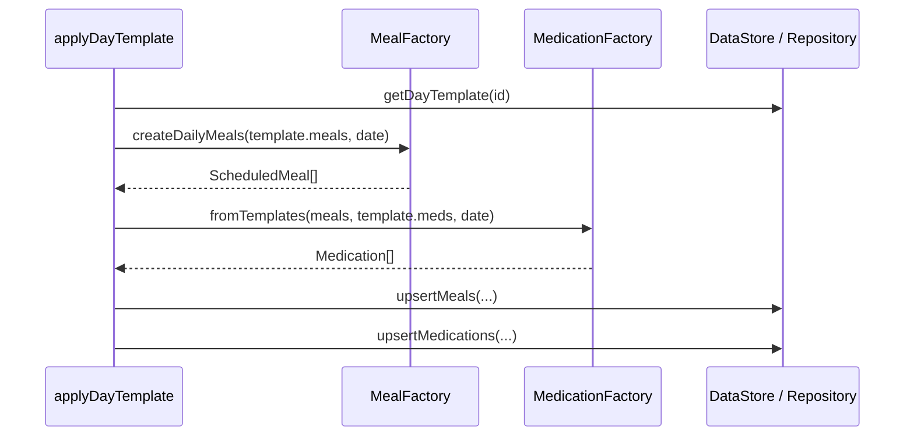
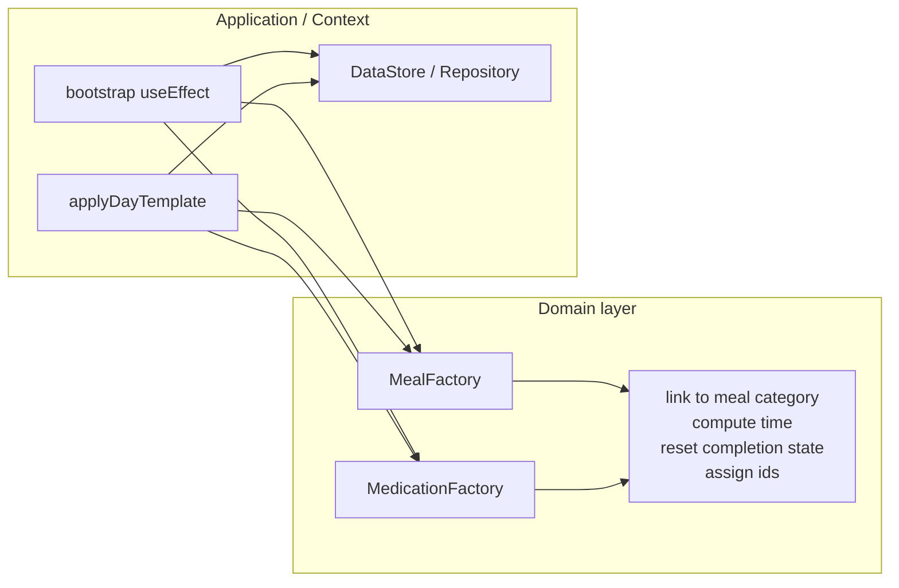

# Bootstrap construction

# Factory Pattern — Learning Session (Astro-Care Step 3)

<aside>
📌

**Refactor context:** Step 3 from the AppContext refactor roadmap — extract object **construction** out of `AppContext.tsx`.

**Source:** `artifacts/mobile/context/AppContext.tsx` · Refactor doc: `artifacts/mobile/docs/notion-appcontext-refactor.md` · Architecture: `artifacts/mobile/docs/file-architecture.md`

**Parent:** Astro-Cart Architecture Refactor

</aside>

---

## 1. What problem are we solving?

Right now, `AppContext` is not only a state holder — it also **knows how to build domain objects**:

| Location                                | What it constructs                                               |
| --------------------------------------- | ---------------------------------------------------------------- |
| `INITIAL_ACHIEVEMENTS` (lines 35–78)    | Default achievement records                                      |
| `buildTodayMedsFromTemplates` (80–105)  | Today's medications from templates + meals                       |
| Bootstrap `useEffect` (231–243)         | Calls the builder, then persists                                 |
| `applyDayTemplate` (852–882)            | Rebuilds meals + meds for a date — **same rules, written again** |
| CRUD handlers (`addFood`, `addMeal`, …) | `{ ...input, id: uid() }`                                        |

The Factory pattern says: **centralize object creation in one place** so callers only say _what_ they want, not _how_ to assemble it.

---

## 2. You already have a Factory (infrastructure)

Your `DataStoreRegistry` is already a factory at the infrastructure layer:

```tsx
// infrastructure/storage/DataStoreRegistery.ts
type DataStoreFactory = () => DataStore;

class DataStoreRegistry {
  private readonly dataStores: Map<string, DataStoreFactory> = new Map();

  register(name: string, dataStore: DataStoreFactory) {
    this.dataStores.set(name, dataStore);
    return this;
  }

  get(name: string): DataStore {
    const dataStore = this.dataStores.get(name);
    if (!dataStore) throw new Error(`Data store ${name} not found`);
    return dataStore();
  }
}
```

Used in `AppContext.tsx`:

```tsx
dataStoreRegistry
  .register("sqlite", () => new SqliteDataStore())
  .register("async-storage", () => new AsyncStorageDataStore());

const dataStore = dataStoreRegistry.get("async-storage");
```

- `register` stores a **creation function** (not an instance)
- `get` invokes it when needed
- `AppContext` does not care _how_ SQLite vs AsyncStorage is built — it asks the registry

**Same mental model for domain objects:** `AppContext` should call `MedicationFactory.fromTemplates(...)`, not inline the mapping logic.

---

## 3. Which Factory flavor fits here?

There are three common variants. For Astro-Care, only one is the right default.

### Simple Factory (recommended)

Plain functions or a small module:

```tsx
MealFactory.createDailyMeals(dayTemplateMeals, date);
MedicationFactory.fromTemplates(meals, templates, date);
```

**Use when:** construction rules are fixed but non-trivial (IDs, defaults, computed times).

### Factory Method

A base type defines `createMeal()`, subclasses override it.

**Use when:** you have _multiple ways_ to create the same kind of object (e.g. from day template vs. onboarding wizard vs. import). **Not needed on day one.**

### Abstract Factory

Creates _families_ of related objects (e.g. `IOSUIFactory` + `AndroidUIFactory`).

**Use when:** entire groups of objects must stay consistent. **Overkill here.**

<aside>
✅

**Verdict for Step 3:** start with **Simple Factory** — pure functions in `domain/factories/`.

</aside>

---

## 4. Factory vs Repository (common confusion)

Both hide "how" behind an abstraction — but they answer **different questions**:

| Pattern                      | Question it answers                 |
| ---------------------------- | ----------------------------------- |
| **Factory / Factory Method** | _How do I build this object?_       |
| **Repository**               | _How do I load / save this object?_ |

### Factory Method — construction recipe

Multiple **assembly algorithms** for the same output type:

```
DayTemplateMealCreator.createMeal(...)   → ScheduledMeal
OnboardingMealCreator.createMeal(...)    → ScheduledMeal
ImportMealCreator.createMeal(...)        → ScheduledMeal
```

Each knows a different recipe: copy from template + assign date, map onboarding answers, parse CSV, etc. Output is **in-memory domain objects**, usually before they exist in storage.

### Repository — persistence boundary

Multiple **storage backends** for the same type:

```
MealRepository.getByDate(date)  → ScheduledMeal[]
MealRepository.upsert(meal)       → void
MealRepository.delete(id)        → void
```

Does not care whether the meal came from a day template, onboarding, or manual add.

### Your codebase — concrete split

At bootstrap (line 236):

```tsx
// 1. FACTORY — builds in-memory objects
const generated = buildTodayMedsFromTemplates(
  todayMeals,
  loadedMedTemplates,
  today,
);

// 2. REPOSITORY — persists them
await dataStore.upsertMedications(generated);
```

| You might think…                       | Actually…                                                                                      |
| -------------------------------------- | ---------------------------------------------------------------------------------------------- |
| "Repository gets meals from templates" | Repo **loads** template data; Factory **turns** template → today's meals                       |
| "Factory saves to SQLite"              | That mixes concerns; save belongs in Repository                                                |
| "DataStore is a factory"               | Registry **creates** store instances; `DataStore` **is** the persistence API (Repository-like) |

### Typical flow (they work together)



---

## 5. Map factories to your real code

### A. `MedicationFactory` — highest value

**Current code** (`AppContext.tsx` lines 80–105):

```tsx
function buildTodayMedsFromTemplates(
  meals: ScheduledMeal[],
  templates: MedicationTemplate[],
  date: string,
): Medication[] {
  return templates.map((template) => {
    const linkedMeal = meals.find(
      (meal) => meal.category === template.linkToCategory,
    );
    return {
      ...template,
      id: uid(),
      templateId: template.id,
      computedTime: linkedMeal
        ? computeMedicationTime(
            linkedMeal.scheduledTime,
            template.relationType,
            template.minutesOffset,
          )
        : undefined,
      completedAt: undefined,
      skipped: false,
      date,
    };
  });
}
```

**Duplicated again** in `applyDayTemplate` (lines 863–881):

```tsx
const newMeds: Medication[] = template.medications.map((med) => {
  const linked = newMeals.find((meal) => meal.category === med.linkToCategory);
  const computedTime = linked
    ? computeMedicationTime(
        linked.scheduledTime,
        med.relationType,
        med.minutesOffset,
      )
    : undefined;
  return {
    ...med,
    id: uid(),
    date,
    completedAt: undefined,
    skipped: false,
    computedTime,
  };
});
```

**Target API:**

```
MedicationFactory
├── fromTemplates(meals, medicationTemplates, date)     ← bootstrap
└── fromDayTemplateMeds(meals, dayTemplateMeds, date)   ← applyDayTemplate
    └── shared: linkMedicationToMeal(medSpec, meals, date)
```

### B. `MealFactory`

**Current inline construction** in `applyDayTemplate`:

```tsx
const newMeals: ScheduledMeal[] = template.meals.map((meal) => ({
  ...meal,
  id: uid(),
  date,
  completedAt: undefined,
  skipped: false,
}));
```

**Target API:**

```tsx
MealFactory.createDailyMeals(dayTemplate.meals, date);
// or
MealFactory.fromDayTemplate(template, date);
```

### C. Seed data — companion, not quite a factory

`INITIAL_ACHIEVEMENTS` is **static fixture data**, not dynamic construction.

```tsx
// domain/seed/seedAchievements.ts
export const INITIAL_ACHIEVEMENTS: Achievement[] = [
  { id: "first-mission", title: "First Mission", /* ... */ unlocked: false },
  // ...
];
```

Optional: `AchievementFactory.createInitialSet()` if you later add versioning or defaults.

### D. Simple CRUD `{ ...x, id: uid() }` — probably NOT factories

`addFood`, `addMealTemplate`, etc. are one-liners. Wrapping them in `FoodFactory.create()` adds ceremony without benefit.

<aside>
💡

**Rule of thumb:** extract a factory when construction involves **business rules**, not when it is only `spread + id`.

</aside>

---

## 6. What goes IN vs OUT of a factory



| Inside factory                | Outside factory                         |
| ----------------------------- | --------------------------------------- |
| Object shape and defaults     | `setState`, React hooks                 |
| `computedTime` from meal link | `dataStore.upsertMedications()`         |
| `uid()` for new instances     | Deleting old day's meals before replace |
| Pure inputs → pure outputs    | Orchestration (Facade / use case)       |

**Factories create; repositories persist; use cases orchestrate.**

---

## 7. SOLID connections

| Principle                     | How Factory helps                                                                                                    |
| ----------------------------- | -------------------------------------------------------------------------------------------------------------------- |
| **S — Single Responsibility** | `AppProvider` manages state lifecycle; factories manage object assembly                                              |
| **O — Open/Closed**           | New creation path (e.g. "duplicate yesterday") = new factory method, not edits across bootstrap + `applyDayTemplate` |
| **D — Dependency Inversion**  | Factory accepts `generateId: () => string` instead of importing `uid` directly — easier to test                      |

ISP / L matter more in Repository (Step 2) and context splitting (Step 5).

---

## 8. Combo E — how factories pair with other patterns

From the refactor doc:

```
applyDayTemplate → MealFactory → MedicationFactory → DayAppliedEvent → streak recalc
```

After factories:

1. **Use case** `applyDayTemplate` loads the day template
2. **MealFactory** builds `ScheduledMeal[]`
3. **MedicationFactory** builds `Medication[]` from those meals
4. **Repository** saves them
5. **Context** only updates React state from the result

---

## 9. Target file structure

```
domain/
  factories/
    mealFactory.ts
    medicationFactory.ts
  seed/
    seedAchievements.ts
    seedFoods.ts          # future
  services/               # Phase 3 — adherence, timeline, streak

application/
  useCases/
    applyDayTemplate.ts   # Phase 4 — orchestration
    bootstrapApp.ts

infrastructure/
  storage/
    DataStoreRegistery.ts  # already exists (infra factory)
    SqliteDataStore.ts
    AsyncStorageDataStore.ts
```

---

## 10. Reference implementations (target)

### `domain/factories/medicationFactory.ts`

```tsx
import type { Medication, MedicationTemplate, ScheduledMeal } from "@/types";
import { computeMedicationTime } from "@/utils/dateUtils";

type GenerateId = () => string;

type MedSpec = Pick<
  Medication,
  | "name"
  | "linkToCategory"
  | "relationType"
  | "minutesOffset"
  | "dosage"
  | "quantity"
  | "image"
  | "notes"
>;

function linkMedicationToMeal(
  spec: MedSpec,
  meals: ScheduledMeal[],
  date: string,
  generateId: GenerateId,
  templateId?: string,
): Medication {
  const linkedMeal = meals.find((m) => m.category === spec.linkToCategory);
  return {
    ...spec,
    id: generateId(),
    templateId,
    date,
    completedAt: undefined,
    skipped: false,
    computedTime: linkedMeal
      ? computeMedicationTime(
          linkedMeal.scheduledTime,
          spec.relationType,
          spec.minutesOffset,
        )
      : undefined,
  };
}

export function fromTemplates(
  meals: ScheduledMeal[],
  templates: MedicationTemplate[],
  date: string,
  generateId: GenerateId,
): Medication[] {
  return templates.map((t) =>
    linkMedicationToMeal(t, meals, date, generateId, t.id),
  );
}

export function fromDayTemplateMeds(
  meals: ScheduledMeal[],
  dayMeds: Omit<
    Medication,
    "id" | "date" | "completedAt" | "skipped" | "computedTime"
  >[],
  date: string,
  generateId: GenerateId,
): Medication[] {
  return dayMeds.map((m) => linkMedicationToMeal(m, meals, date, generateId));
}
```

### `domain/factories/mealFactory.ts`

```tsx
import type { DayTemplate, ScheduledMeal } from "@/types";

type GenerateId = () => string;

type MealSpec = Omit<ScheduledMeal, "id" | "date" | "completedAt" | "skipped">;

export function createDailyMeals(
  mealSpecs: MealSpec[],
  date: string,
  generateId: GenerateId,
): ScheduledMeal[] {
  return mealSpecs.map((meal) => ({
    ...meal,
    id: generateId(),
    date,
    completedAt: undefined,
    skipped: false,
  }));
}

export function fromDayTemplate(
  template: DayTemplate,
  date: string,
  generateId: GenerateId,
): ScheduledMeal[] {
  return createDailyMeals(template.meals, date, generateId);
}
```

### `AppContext` after extraction (sketch)

```tsx
import * as MedicationFactory from "@/domain/factories/medicationFactory";
import * as MealFactory from "@/domain/factories/mealFactory";
import { INITIAL_ACHIEVEMENTS } from "@/domain/seed/seedAchievements";
import { uid } from "@/utils/dateUtils";

// Bootstrap
const generated = MedicationFactory.fromTemplates(
  todayMeals,
  loadedMedTemplates,
  today,
  uid,
);
await dataStore.upsertMedications(generated);

// applyDayTemplate
const newMeals = MealFactory.fromDayTemplate(template, date, uid);
const newMeds = MedicationFactory.fromDayTemplateMeds(
  newMeals,
  template.medications,
  date,
  uid,
);
// ... delete old + persist + setState (orchestration stays here / in use case)
```

---

## 11. Incremental migration path

> **Scope:** Phase 1 only (Simple Factory). Do not start domain services, use cases, or context splitting until these steps are done.
>
> **Architecture reference:** [`file-architecture.md`](./file-architecture.md)

### Before you start

- [ ] Read `AppContext.tsx` lines **35–105** (seed + `buildTodayMedsFromTemplates`) and **852–903** (`applyDayTemplate`) — these are the only factory targets for now
- [ ] Confirm: factories **build** objects; `DataStore` **loads/saves** them — do not move CRUD or `setState` into factories
- [ ] Skip factories for `{ ...x, id: uid() }` one-liners (`addFood`, `addMealTemplate`, etc.)

---

### Step 1 — Seed data (smallest win)

**Goal:** move static data out of `AppContext`; no behavior change.

- [ ] Create `domain/seed/seedAchievements.ts`
- [ ] Move `INITIAL_ACHIEVEMENTS` from `AppContext.tsx` into that file
- [ ] Import it back in `AppContext` where achievements are seeded (bootstrap block ~249–255)
- [ ] Run the app — achievements still seed on first launch

**Stop here if anything breaks. Do not continue until this works.**

---

### Step 2 — Medication factory (bootstrap path)

**Goal:** extract med materialization used on app start.

- [ ] Create `domain/factories/medicationFactory.ts`
- [ ] Move `buildTodayMedsFromTemplates` → export as `fromTemplates(meals, templates, date)`
- [ ] Keep logic pure: no `dataStore`, no React — only inputs → `ScheduledMedication[]`
- [ ] Replace the call in bootstrap `useEffect` (~236) with `MedicationFactory.fromTemplates(...)`
- [ ] Delete the old function from `AppContext`
- [ ] Run the app — on a fresh day (or cleared today’s meds), today’s meds should still generate from templates

**Verify:** med `computedTime` still links to the correct meal category.

---

### Step 3 — Meal factory (`applyDayTemplate` meals)

**Goal:** extract meal materialization from day templates.

- [ ] Create `domain/factories/mealFactory.ts`
- [ ] Add `createDailyMeals(mealSpecs, date)` — template meal specs → `ScheduledMeal[]` with new id, date, reset completion flags
- [ ] In `applyDayTemplate` (~856–862), replace inline `.map(...)` with `MealFactory.createDailyMeals(...)`
- [ ] Run the app — apply a day template on calendar; meals for that date should match before

**Leave in `applyDayTemplate`:** delete old day’s meals, `upsertMeals`, `setAllMeals` — that is orchestration, not factory.

---

### Step 4 — Deduplicate meds in `applyDayTemplate`

**Goal:** one med-building rule for bootstrap and apply-day-template.

- [ ] Add `fromDayTemplateMeds(meals, dayTemplateMeds, date)` to `medicationFactory.ts` (same linking rule as `fromTemplates`, different input shape)
- [ ] Extract shared “link med to meal → compute time → assign id/date/defaults” into a private helper inside the factory file
- [ ] In `applyDayTemplate` (~863–881), replace inline med `.map(...)` with `MedicationFactory.fromDayTemplateMeds(...)`
- [ ] Run the app — apply day template; meds should still get correct `computedTime`

---

### Step 5 — Third duplicate: `addMedicationTemplate`

**Goal:** stop copying med materialization a third time.

- [ ] Find med instance build in `addMedicationTemplate` (~698–706)
- [ ] Reuse `medicationFactory` (e.g. `fromTemplate` for a single template + today’s meals)
- [ ] Run the app — add a new med template in settings; today’s scheduled med should still appear

---

### Step 6 — Optional: testable ID generation

**Goal:** make factories unit-testable without changing app behavior.

- [ ] Add optional `generateId` parameter to factory functions (default: `uid` from `dateUtils`)
- [ ] Add one unit test for `fromTemplates` — breakfast at 08:00 + “after +30min” → `computedTime` is `08:30`

**Skip if you are not writing tests yet.**

---

### Step 7 — Stop (do not go further yet)

Phase 1 is complete when all factory build paths use `domain/factories/` and `AppContext` no longer contains inline med/meal materialization.

**Do not start until Phase 1 is stable:**

| Later phase | What                                                  | Folder                  |
| ----------- | ----------------------------------------------------- | ----------------------- |
| Phase 3     | `todayStats`, streak, timelines                       | `domain/services/`      |
| Phase 4     | `bootstrapApp`, `applyDayTemplate` orchestration      | `application/useCases/` |
| Phase 5     | Split `useApp()` into `useMeals`, `useMedications`, … | `context/hooks/`        |

**Do not introduce Factory Method or Strategy** until you have a second real way to build a day (e.g. onboarding wizard vs day template).

---

### Quick checklist — am I done with Phase 1?

- [ ] `INITIAL_ACHIEVEMENTS` lives in `domain/seed/`
- [ ] No `buildTodayMedsFromTemplates` in `AppContext`
- [ ] `applyDayTemplate` uses `MealFactory` + `MedicationFactory` (no inline `.map` build logic)
- [ ] `addMedicationTemplate` uses `medicationFactory` (no inline build block)
- [ ] Factory files have zero imports from `context/`, React, or `dataStore`
- [ ] App still boots, applies day templates, and adds med templates correctly

---

## 12. Unit test example

Because factories are **pure functions**, test without React:

```tsx
describe("MedicationFactory.fromTemplates", () => {
  it("computes time from linked meal category", () => {
    const meals = [
      {
        id: "m1",
        category: "breakfast",
        scheduledTime: "08:00",
        date: "2026-06-24",
        name: "Breakfast",
        reminderEnabled: true,
        items: [],
      },
    ];
    const templates = [
      {
        id: "t1",
        name: "Vitamin D",
        linkToCategory: "breakfast",
        relationType: "after",
        minutesOffset: 30,
      },
    ];

    const result = fromTemplates(meals, templates, "2026-06-24", () => "med-1");

    expect(result[0].computedTime).toBe("08:30");
    expect(result[0].skipped).toBe(false);
    expect(result[0].date).toBe("2026-06-24");
    expect(result[0].templateId).toBe("t1");
  });
});
```

---

## 13. Pitfalls to avoid

1. **Factory that persists** — if `MedicationFactory` calls `dataStore`, it is a service mixing creation + IO
2. **Factory for every entity** — `FoodFactory.create({ ...food, id })` adds noise; skip it
3. **Abstract Factory too early** — wait until you have a second real creation strategy
4. **Hiding orchestration** — replacing today's meals then inserting new ones stays in `applyDayTemplate` use case, not inside `MealFactory`

---

## 14. Mental checklist before you extract

Ask for each block of construction code:

1. Does it encode a **domain rule**? (link med to meal category, reset day state)
2. Is it **duplicated** in more than one place?
3. Can it be **pure** (no React, no storage)?
4. Would a **wrong implementation** cause subtle bugs? (med times off by 30 min)

**Yes → factory. Only `id: uid()` → leave inline.**

---

## Summary

| What                                    | Why                                                                |
| --------------------------------------- | ------------------------------------------------------------------ |
| **MedicationFactory** • **MealFactory** | Remove duplicated construction from bootstrap + `applyDayTemplate` |
| **Seed modules**                        | Companions for static fixture data (`INITIAL_ACHIEVEMENTS`)        |
| **DataStoreRegistry**                   | Already a factory at infra layer — mirror at domain layer          |
| Keep factories **pure**                 | Repositories persist; use cases orchestrate                        |

<aside>
🎯

**Key takeaway:** The provider should **coordinate**, not **manufacture**. ~80–120 lines leave `AppContext`, construction rules become unit-testable, and you get a concrete SOLID lesson (S, O, D).

</aside>
